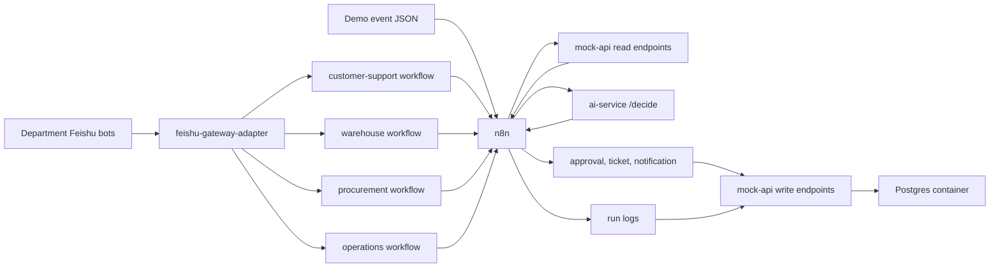

# Internal Ecommerce Operations Copilot

Docker-first portfolio project for an internal ecommerce operations copilot. It uses one Feishu Gateway Adapter, multiple department-specific n8n workflows, FastAPI services for AI logic and mock enterprise APIs, and scripted events for repeatable demos.

## What This Demonstrates

- n8n workflow orchestration for enterprise-style automation.
- One Feishu gateway adapter that can connect multiple department bots to separate n8n workflows.
- FastAPI AI service with structured outputs and deterministic test mode.
- Mock enterprise APIs for orders, inventory, logistics, support, approvals, run logs, and replay.
- Docker Compose local deployment.
- AI Ops patterns: schema validation, approval guardrails, run logging, dead-letter, replay.

## Architecture



The current implementation keeps business state in memory for a lightweight local demo while running Postgres in Compose as the operational store target for the next phase.

## Quick Start

```powershell
docker compose up --build -d
```

Open n8n at `http://localhost:5678`.

Health checks:

```powershell
Invoke-RestMethod http://localhost:8001/health
Invoke-RestMethod http://localhost:8002/health
Invoke-RestMethod http://localhost:8010/health/details | ConvertTo-Json -Depth 10
Invoke-RestMethod http://localhost:8002/orders/ord_100
```

## Import n8n Workflow

The workflow file is `n8n/workflows/ecommerce-after-sales.json`. It exposes:

```text
POST /webhook/after-sales-event
```

CLI import:

```powershell
docker compose exec -T n8n n8n import:workflow --input=/workflows/ecommerce-after-sales.json
docker compose exec -T n8n n8n publish:workflow --id=wf_ecommerce_after_sales
docker compose exec -T n8n n8n update:workflow --id=wf_ecommerce_after_sales --active=true
docker compose restart n8n
```

## Demo

Send a high-value refund event:

```powershell
powershell -ExecutionPolicy Bypass -File .\scripts\send_event.ps1 -EventFile fixtures/events/refund_high_value.json
```

Expected result: the workflow returns a structured AI decision, creates a pending approval request, and writes a succeeded run log.

Replay a failed event:

```powershell
powershell -ExecutionPolicy Bypass -File .\scripts\replay_failed_event.ps1 -EventId evt_mock_api_failure
```

Expected result: `queued_for_replay`.

## Message Agent Demo

The second workflow is `n8n/workflows/message-agent.json`. It exposes:

```text
POST /webhook/message-agent
```

It accepts text or audio-shaped message payloads, calls `ai-service /message/handle`, and lets the agent invoke the first tool: `get_order_status`.

Import it with:

```powershell
docker compose exec -T n8n n8n import:workflow --input=/workflows/message-agent.json
docker compose exec -T n8n n8n publish:workflow --id=wf_message_agent
docker compose restart n8n
```

Send a text message:

```powershell
powershell -ExecutionPolicy Bypass -File .\scripts\send_message.ps1 -MessageFile fixtures\messages\order_status_text.json
```

Audio support is adapter-based. The current default is `TRANSCRIPTION_PROVIDER=mock`. To connect Qwen, provide `QWEN_API_ENDPOINT`, `QWEN_API_KEY`, the confirmed model name, the expected audio input format, and an example response JSON.

## Feishu Gateway Adapter

`feishu-adapter` is a dedicated container for Feishu/Lark protocol handling. It can run as a gateway for multiple department bots through `FEISHU_BOTS_JSON`. Each configured bot opens its own Feishu long connection, forwards messages to its own n8n webhook, deduplicates by `bot_name + message_id`, and replies with that bot's own credentials.

Leave `FEISHU_BOTS_JSON` empty to keep the legacy single-bot fallback with `FEISHU_APP_ID`, `FEISHU_APP_SECRET`, and `N8N_CHAT_WEBHOOK_URL`.

Local simulation endpoint:

```text
POST http://localhost:8010/feishu/events
```

Department bot target example:

```text
FEISHU_BOTS_JSON=[{"name":"customer_support","app_id":"cli_customer","app_secret":"secret_customer","n8n_webhook_url":"http://n8n:5678/webhook/customer-support-inbound"}]
```

For real Feishu long connection subscriptions, keep `FEISHU_EVENT_MODE=long_connection`, enable the app's event subscription for `im.message.receive_v1`, install the bot in the target chat, and start Docker. The adapter logs `connected to wss://msg-frontier.feishu.cn/...` when the long connection is live.

## Department Chat Workflows

The recommended internal chat architecture uses independent department workflows, not a parent/son dispatch graph:

- `n8n/workflows/customer-support-workflow.json` exposes `/webhook/customer-support-inbound`.
- `n8n/workflows/warehouse-workflow.json` exposes `/webhook/warehouse-inbound`.
- `n8n/workflows/procurement-workflow.json` exposes `/webhook/procurement-inbound`.
- `n8n/workflows/operations-workflow.json` exposes `/webhook/operations-inbound`.

`n8n/workflows/chat-parent-son-agent.json` remains in the repository as a compatibility artifact, but it is no longer the recommended primary chat path.

Import and publish:

```powershell
docker compose exec -T n8n n8n import:workflow --input=/workflows/customer-support-workflow.json
docker compose exec -T n8n n8n import:workflow --input=/workflows/warehouse-workflow.json
docker compose exec -T n8n n8n import:workflow --input=/workflows/procurement-workflow.json
docker compose exec -T n8n n8n import:workflow --input=/workflows/operations-workflow.json
docker compose exec -T n8n n8n publish:workflow --id=customer-support-workflow
docker compose exec -T n8n n8n publish:workflow --id=warehouse-workflow
docker compose exec -T n8n n8n publish:workflow --id=procurement-workflow
docker compose exec -T n8n n8n publish:workflow --id=operations-workflow
docker compose restart n8n
```

## Useful Endpoints

- `GET http://localhost:8001/health`
- `POST http://localhost:8001/decide`
- `POST http://localhost:8001/message/handle`
- `GET http://localhost:8010/health`
- `GET http://localhost:8010/health/details`
- `POST http://localhost:8010/feishu/events`
- `POST http://localhost:8010/warehouse/inventory-table/sync`
- `GET http://localhost:8002/orders/{order_id}`
- `GET http://localhost:8002/customers/{customer_id}`
- `GET http://localhost:8002/shipments/{shipment_id}`
- `GET http://localhost:8002/inventory/{sku}`
- `GET http://localhost:8002/approval-requests`
- `GET http://localhost:8002/tickets`
- `GET http://localhost:8002/internal-notifications`
- `GET http://localhost:8002/run-logs`
- `GET http://localhost:8002/dead-letter`

## Test

Run service tests separately to avoid duplicate `test_api.py` import names across service packages:

```powershell
pytest services\ai-service\tests
pytest services\mock-api\tests
pytest services\feishu-adapter\tests
pytest tests\test_chat_parent_son_workflow.py
pytest tests\test_department_workflows.py
```

## Project Documents

- [Architecture](docs/architecture.md)
- [Demo Script](docs/demo-script.md)
- [Deployment and Operations](docs/deployment.md)
- [Warehouse Inventory Feishu Table Sync](docs/warehouse-inventory-table-sync.md)
- [Local Runbook](docs/local-runbook.md)
- [n8n Workflow Contract](docs/n8n-workflow-contract.md)
- [中文 README](README.zh.md)
