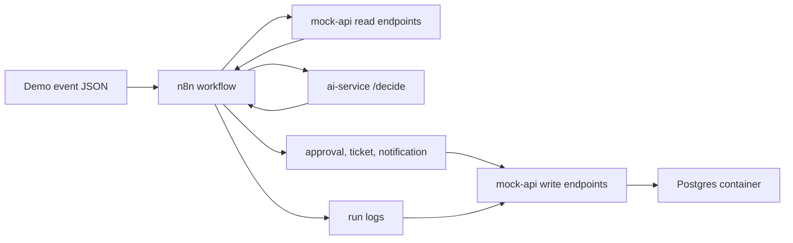

# Ecommerce After-sales Multi-agent Workflow

Docker-first portfolio project for an enterprise-style ecommerce after-sales workflow. It uses n8n for orchestration, FastAPI services for AI decisioning and mock enterprise APIs, and scripted events for repeatable demos.

## What This Demonstrates

- n8n workflow orchestration for enterprise-style automation.
- FastAPI AI service with structured outputs and deterministic test mode.
- Mock enterprise APIs for orders, inventory, logistics, support, approvals, run logs, and replay.
- Docker Compose local deployment.
- AI Ops patterns: schema validation, approval guardrails, run logging, dead-letter, replay.

## Architecture



The current implementation keeps business state in memory for a lightweight local demo while running Postgres in Compose as the operational store target for the next phase.

## Quick Start

```powershell
docker compose up --build -d
```

Open n8n at `http://localhost:5678`.

Health checks:

```powershell
Invoke-RestMethod http://localhost:8001/health
Invoke-RestMethod http://localhost:8002/health
Invoke-RestMethod http://localhost:8002/orders/ord_100
```

## Import n8n Workflow

The workflow file is `n8n/workflows/ecommerce-after-sales.json`. It exposes:

```text
POST /webhook/after-sales-event
```

CLI import:

```powershell
docker compose exec -T n8n n8n import:workflow --input=/workflows/ecommerce-after-sales.json
docker compose exec -T n8n n8n publish:workflow --id=wf_ecommerce_after_sales
docker compose exec -T n8n n8n update:workflow --id=wf_ecommerce_after_sales --active=true
docker compose restart n8n
```

## Demo

Send a high-value refund event:

```powershell
powershell -ExecutionPolicy Bypass -File .\scripts\send_event.ps1 -EventFile fixtures/events/refund_high_value.json
```

Expected result: the workflow returns a structured AI decision, creates a pending approval request, and writes a succeeded run log.

Replay a failed event:

```powershell
powershell -ExecutionPolicy Bypass -File .\scripts\replay_failed_event.ps1 -EventId evt_mock_api_failure
```

Expected result: `queued_for_replay`.

## Useful Endpoints

- `GET http://localhost:8001/health`
- `POST http://localhost:8001/decide`
- `GET http://localhost:8002/orders/{order_id}`
- `GET http://localhost:8002/customers/{customer_id}`
- `GET http://localhost:8002/shipments/{shipment_id}`
- `GET http://localhost:8002/inventory/{sku}`
- `GET http://localhost:8002/approval-requests`
- `GET http://localhost:8002/tickets`
- `GET http://localhost:8002/internal-notifications`
- `GET http://localhost:8002/run-logs`
- `GET http://localhost:8002/dead-letter`

## Test

Run service tests separately to avoid duplicate `test_api.py` import names across service packages:

```powershell
pytest services\ai-service\tests
pytest services\mock-api\tests
```

## Project Documents

- [Architecture](docs/architecture.md)
- [Demo Script](docs/demo-script.md)
- [Local Runbook](docs/local-runbook.md)
- [n8n Workflow Contract](docs/n8n-workflow-contract.md)
- [中文 README](README.zh.md)
