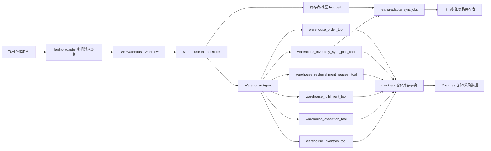
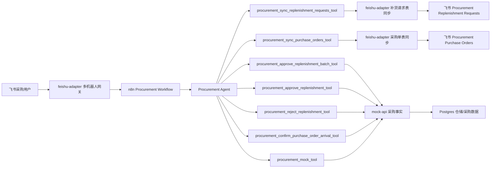
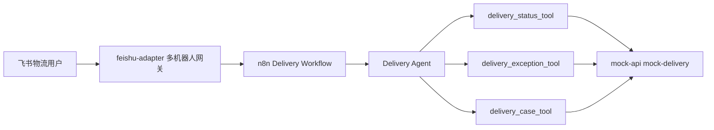

# 仓储agent

## 汇总

- 仓储 Agent 以“批次 + 库位”为核心模型处理库存，不再只看旧的 SKU 快照；回复中会保留商品、仓库、库位、批次、可用库存、临期风险和处理建议。
- 支持仓储库存查询、仓储异常查询、履约风险判断、补货申请创建、飞书库存表同步、飞书库存视图创建等完整仓储工作流。
- 飞书库存表是只读 read model：系统库存事实仍在 mock-api / Postgres 中，飞书表用于运营查看、筛选和同步展示。
- 采购确认到货后会创建 `RCV-POD-*` 入库批次，并生成 `warehouse_inventory_sync_requested` 同步任务；Warehouse Agent 消费这些任务后再同步到飞书库存表。
- 库存同步已按 sync job 精确同步实现：只处理本次任务对应的批次数据；表存在时插入或更新，表不存在时自动创建后写入。
- 对飞书批量写入做了优化：多条 sync job 合并为一次后端同步流程，写入使用 batch create/update；查询已有记录时会按 filter 长度分块，避免触发飞书 `FilterLengthExceedLimit`。

## workflow 架构

仓储 workflow 的入口是 `n8n/workflows/warehouse-workflow.json`。飞书消息先进入 `feishu-adapter`，再路由到 Warehouse Workflow。Workflow 会先做意图识别：明确的库存表同步、视图创建会走 fast path；其余仓储问题进入 Warehouse Agent，由 Agent 根据工具说明调用库存、异常、履约、补货或同步任务工具。

采购到仓链路由 Procurement Workflow 触发，但库存同步完成权在 Warehouse Workflow。采购确认 `POD-*` 到货后，mock-api 会生成入库批次和 pending sync job；用户在飞书中要求“处理库存同步任务”时，`warehouse_inventory_sync_jobs_tool` 拉取 pending job，调用 feishu-adapter 的批量 sync jobs 能力，最后把任务标记为 completed 或 failed。

## 功能

- 查询库存：`@warehouse 查询 item_vinda_tissue 库存` 会返回商品在不同仓库、库位和批次上的库存、可用数量、预留数量、临期状态和风险等级。
- 查询仓储异常：`@warehouse 查询 item_vinda_tissue 仓储异常` 会检查库存不足、临期、过期、质检冻结、库位异常等风险，并返回处理建议。
- 判断履约风险：`@warehouse item_vinda_tissue 能否发货` 会根据可用库存、预留库存、存储状态和临期风险判断是否可以出库。
- 创建补货申请：当库存低于补货阈值且用户要求补货时，Warehouse Agent 会创建 `pending_procurement_review` 补货申请，交给 Procurement Agent 后续审批。
- 同步库存表：`@warehouse 同步 item_vinda_tissue 库存到飞书` 会把匹配的批次库存快照同步到飞书 `Warehouse Inventory Snapshot` 表。
- 创建库存视图：`@warehouse 创建高风险库存视图` 会读取真实飞书表字段，并按受控模板创建或复用库存视图。
- 处理同步任务：`@warehouse 处理库存同步任务` 会消费采购到仓生成的 pending sync jobs，只同步对应 `RCV-POD-*` 批次，并把任务标记为 completed 或 failed。
- 订单驱动库存扣减：订单付款后按 FEFO 扣减 `inventory_location_balances`，发货和到货只更新状态，取消或退货按 `order_items` 原批次加回。

## mock-api

`mock-api` 是仓储和采购事实数据的模拟企业系统，仓储 Agent 的多数业务工具最终都落到这里：

- 初始化并维护仓储主数据：仓库、库位、分类、商品、批次库存。
- 提供批次库存查询能力：按 `item_id`、仓库、库位、分类、批次、风险等维度返回库存事实。
- 计算仓储派生字段：可用库存、临期状态、风险等级、处理建议、履约阻塞原因。
- 支持仓储异常和履约判断：用于回答库存差异、临期、过期、质检冻结、缺货和能否发货等问题。
- 提供批次级库位余额和订单状态流转能力：`inventory_batches` 只保留入库事实，当前库存由 `inventory_location_balances` 承担，订单付款按 FEFO 扣减。
- 承接补货申请：Warehouse 创建 `pending_procurement_review` 补货申请，Procurement 后续审批。
- 支持采购到仓后的库存事实更新：确认 `POD-*` 到货会创建 `RCV-POD-*` 入库批次。
- 管理仓储库存同步任务：创建、查询、完成或失败 `warehouse_inventory_sync_requested` job。

在配置 `DATABASE_URL` 时，这些仓储与采购记录优先落 Postgres；本地轻量 mock 模式下仍保留内存 fallback。

## feishu-adapter

`feishu-adapter` 负责飞书协议、多机器人网关和飞书多维表格读模型同步：

- 多机器人网关：通过 `FEISHU_BOTS_JSON` 配置客户、仓储、采购、运营等部门 bot，每个 bot 转发到自己的 n8n webhook。
- 长连接收消息：默认使用飞书长连接模式，归一化飞书消息，按 `bot_name + message_id` 去重，并把 n8n 回复发回飞书。
- 仓储意图路由：识别库存表同步、视图模板创建等明确意图，让简单请求走 fast path，减少 Agent 循环。
- 飞书库存表创建：在已有多维表格 app/base 中创建或复用固定 schema 的 `Warehouse Inventory Snapshot` 表。
- 飞书库存同步：支持按商品、仓库、库位、分类、风险过滤同步，也支持按 sync job 精确同步本次采购到仓批次。
- 批量写入优化：对多条 sync job 聚合处理，统一获取 token、建表、取字段和写入；使用 batch create/update 写飞书记录。
- 防止飞书 filter 超限：查询已有记录时按 filter 字符串长度拆分为多次小查询，避免 20 条以上批次同步时触发 `FilterLengthExceedLimit`。
- 视图创建能力：读取真实表字段和已有视图，根据自然语言模板创建高风险库存、低库存预警等受控 grid 视图。
- 运行日志：向 mock-api 写入结构化 run log，方便排查同步成功、失败和耗时。

# 采购agent

## 汇总

- 采购 Agent 以 `replenishment_requests`、`procurement_suppliers` 和 `purchase_orders` 为核心模型处理补货申请、采购单生成和到仓确认。
- 支持同步补货请求到飞书、同步采购单到飞书、单条批准/驳回 `REQ-*`、批量批准全部 pending 补货申请、确认 `PO-*` 到仓等完整采购工作流。
- 飞书采购表是只读 read model：系统事实仍在 mock-api / Postgres 中，飞书表用于采购人员 review、筛选和跟踪。
- 批准补货申请后会创建或复用 `PO-*` 采购单，申请状态从 `pending_procurement_review` 进入 `purchase_order_created`；重复批准不会重复创建采购单。
- 采购单有两个独立状态：`payment_status` 表示未支付/已支付，`warehouse_sync_status` 表示待到仓、到库未同步、已同步。
- 采购确认 `PO-*` 到仓后，只把采购单标记为 `arrived_unsynced` 并刷新采购单飞书表；库存批次同步由 Warehouse 后续检查未同步采购单后完成。

## workflow 架构

采购 workflow 的入口是 `n8n/workflows/procurement-workflow.json`。飞书消息先进入 `feishu-adapter`，再路由到 Procurement Workflow。采购 Agent 根据用户表达选择同步、审批、驳回、批量生成采购单或到仓确认工具；涉及飞书视图的请求会调用 feishu-adapter，涉及采购事实的请求会调用 mock-api。

仓储到采购链路从 Warehouse Workflow 创建补货申请开始。仓储侧只创建 `pending_procurement_review` 申请，不做采购决策；采购侧 review 后批准或驳回。采购单到仓后，采购侧只维护采购单的仓库同步状态，不直接写库存批次，不创建 Warehouse sync job。

## 功能

- 同步补货请求：`@procurement 同步补货请求` 会把数据库补货申请同步到飞书 `Procurement Replenishment Requests` 表。
- 批量批准：`@procurement 批量批准生成采购单` 会批准全部 pending 补货申请，生成或复用采购单，并刷新两张采购飞书表。
- 同步采购单：`@procurement 同步采购单` 会把采购单同步到飞书 `Procurement Purchase Orders` 表。
- 单条批准：`@procurement 批准 REQ-1001 生成采购单` 会批准指定补货申请，并返回 `PO-*` 采购单。
- 单条驳回：`@procurement 驳回 REQ-1001，原因：库存已调拨覆盖` 会把申请状态更新为 `rejected`，并记录拒绝原因。
- 到仓确认：`@procurement PO-5001 已到仓库` 会确认采购单到仓，把 `warehouse_sync_status` 更新为 `arrived_unsynced`，并刷新采购单飞书表。

## mock-api

采购 Agent 的事实数据由 `mock-api` 提供：

- 管理 `replenishment_requests`，承接 Warehouse 创建的 `pending_procurement_review` 补货申请。
- 管理 mock 默认供应商，按 `item_id` 匹配供应商、单价和交期。
- 管理 `purchase_orders`，记录供应商、商品、仓库、库位、数量、单价、预计总价、交期、预计到达日期、支付状态和仓库同步状态。
- 提供补货请求和采购单的 table schema / rows API，作为飞书采购表同步数据源。
- 确认 `PO-*` 到仓时只更新采购单的 `warehouse_sync_status=arrived_unsynced`，不直接创建库存批次或 Warehouse sync job。

## feishu-adapter

采购飞书表同步由 `feishu-adapter` 负责：

- 创建或复用 `Procurement Replenishment Requests`，按 `Request ID` upsert。
- 创建或复用 `Procurement Purchase Orders`，按 `Purchase Order ID` upsert。
- 复用同一个飞书 Base/app 凭据；未配置 table id 时自动建表。
- 同步结果会返回表链接、写入数量和错误信息，供采购 Agent 回复用户。

# 物流agent

## 汇总

- 物流 Agent 负责查询订单或运单配送状态、承运商、延迟天数、风险等级和处理建议。
- 支持查询延迟、丢件等 mock 物流异常列表，也支持在用户明确要求时创建物流跟进 case。
- 物流 Agent 不处理退款、赔偿或售后政策决策；这类请求只建议转交 Customer Support。

## workflow 架构

物流 workflow 的入口是 `n8n/workflows/delivery-workflow.json`，webhook 是 `/webhook/delivery-inbound`。飞书消息经 `feishu-adapter` 多机器人网关进入 Delivery Workflow 后，由 Delivery Agent 按需调用 `delivery_status_tool`、`delivery_exception_tool` 或 `delivery_case_tool`。

## 功能

- 查询物流状态：`@delivery 查询 ord_101 物流` 会返回订单/运单、承运商、状态、预计送达、延迟天数、风险等级和建议动作。
- 汇总物流异常：`@delivery 当前有哪些延迟物流` 会按延迟、丢件或承运商筛选异常运单。
- 创建物流 case：`@delivery 为 ord_101 创建物流延迟跟进 case` 会创建 mock delivery case，供后续人工或系统跟进。

## mock-api

物流 mock 能力由 `mock-api` 提供：

- `POST /delivery/status/lookup`：按 `order_id` 或 `shipment_id` 查询物流状态。
- `POST /delivery/exceptions/search`：查询延迟、丢件或异常运单。
- `POST /delivery/cases`：创建物流跟进 case。
