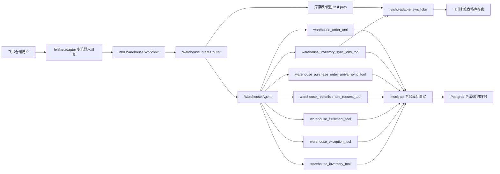
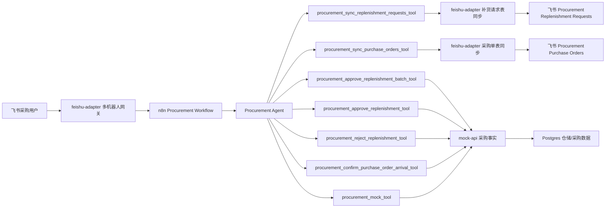
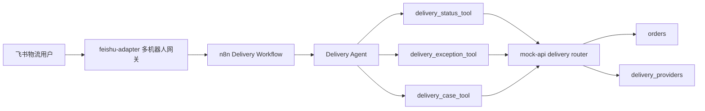
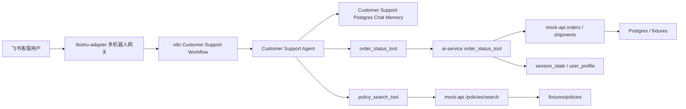

# 仓储agent

## 汇总

- 仓储 Agent 以“批次 + 库位”为核心模型处理库存，不再只看旧的 SKU 快照；回复中会保留商品、仓库、库位、批次、可用库存、临期风险和处理建议。
- 支持仓储库存查询、仓储异常查询、履约风险判断、补货申请创建、飞书库存表同步、飞书库存视图创建等完整仓储工作流。
- 飞书库存表是只读 read model：系统库存事实仍在 mock-api / Postgres 中，飞书表用于运营查看、筛选和同步展示。
- 飞书库存余额表支持一行一个 `item_id + warehouse_id + location_code` 的聚合余额同步；余额为 0 的记录不会删除，会在飞书中显示为 0。
- 采购确认 `PO-*` 到仓后只把 `purchase_orders.warehouse_sync_status` 标记为 `arrived_unsynced`；库存事实写入由 Warehouse 后续扫描未同步采购单完成。
- 补货申请状态已收敛为 `未审批` 和 `已审批` 两种；驳回申请时仍保持 `未审批`，拒绝原因写入 `reason`。
- 秒杀链路使用 Redis Lua 扣减独立营销库存配额，成功后立即复用仓储订单接口创建 `未付款` 订单，订单失败时会补偿 Redis 配额。
- 飞书库存同步仍支持按商品、仓库、库位、批次或风险范围同步；历史 sync job 链路保留用于处理旧的 pending 库存同步任务。

## workflow 架构

仓储 workflow 的入口是 `n8n/workflows/warehouse-workflow.json`。飞书消息先进入 `feishu-adapter`，再路由到 Warehouse Workflow。Workflow 会先做意图识别：明确的库存表同步、视图创建会走 fast path；其余仓储问题进入 Warehouse Agent，由 Agent 根据工具说明调用库存、异常、履约、补货或同步任务工具。

库存余额飞书表由 `n8n/workflows/warehouse-inventory-balances-refresh.json` 定时刷新，每 10 分钟调用一次 `feishu-adapter /warehouse/inventory-balances-table/sync`，每页最多同步 500 条余额行。

采购到仓链路由 Procurement Workflow 触发，但库存同步完成权在 Warehouse Workflow。采购确认 `PO-*` 到货后，mock-api 只把采购单标记为 `warehouse_sync_status=arrived_unsynced` 并写入 `arrived_at`，不直接创建库存批次或 Warehouse sync job；Warehouse 后续扫描 `payment_status=paid` 且 `warehouse_sync_status=arrived_unsynced` 的采购单，按 `BATCH-YYYYMMDD` 写入 `inventory_batches` 和 `inventory_location_balances`，完成后把采购单标记为 `synced`。旧的 `warehouse_inventory_sync_jobs_tool` 仍用于处理历史 pending sync job。

## 功能

- 查询库存：`@warehouse 查询 item_vinda_tissue 库存` 会返回商品在不同仓库、库位和批次上的库存、可用数量、预留数量、临期状态和风险等级。
- 查询仓储异常：`@warehouse 查询 item_vinda_tissue 仓储异常` 会检查库存不足、临期、过期、质检冻结、库位异常等风险，并返回处理建议。
- 判断履约风险：`@warehouse item_vinda_tissue 能否发货` 会根据可用库存、预留库存、存储状态和临期风险判断是否可以出库。
- 创建补货申请：当库存低于补货阈值且用户要求补货时，Warehouse Agent 会创建 `未审批` 补货申请，交给 Procurement Agent 后续审批。
- 同步库存表：`@warehouse 同步 item_vinda_tissue 库存到飞书` 会把匹配的批次库存快照同步到飞书 `Warehouse Inventory Snapshot` 表。
- 创建库存视图：`@warehouse 创建高风险库存视图` 会读取真实飞书表字段，并按受控模板创建或复用库存视图。
- 同步采购到仓库存：`@warehouse 同步采购到仓库存` 会扫描已支付且到仓未同步的 `PO-*`，按实际到仓日期生成 `BATCH-YYYYMMDD` 批次，写入批次事实表和库位余额表。
- 处理历史同步任务：`@warehouse 处理库存同步任务` 会消费旧链路遗留的 pending sync jobs，只同步对应批次，并把任务标记为 completed 或 failed。
- 订单驱动库存扣减：用户下单创建订单时按整单同仓和 FEFO 扣减 `inventory_location_balances`，付款只更新为待发货，取消、退款、退货或超时释放按 `order_items` 原批次加回。
- 未付款订单超时释放：`warehouse-order-timeout-release.json` 每 5 分钟调用 `POST /warehouse/orders/release-expired`，把超时未付款订单更新为 `已取消` 并回滚库存。

## mock-api

`mock-api` 是仓储和采购事实数据的模拟企业系统，仓储 Agent 的多数业务工具最终都落到这里：

- 初始化并维护仓储主数据：仓库、库位、分类、商品、批次库存。
- 提供批次库存查询能力：按 `item_id`、仓库、库位、分类、批次、风险等维度返回库存事实。
- 计算仓储派生字段：可用库存、临期状态、风险等级、处理建议、履约阻塞原因。
- 支持仓储异常和履约判断：用于回答库存差异、临期、过期、质检冻结、缺货和能否发货等问题。
- 提供批次级库位余额和订单状态流转能力：`inventory_batches` 只保留入库事实，当前库存由 `inventory_location_balances` 承担，订单创建时按 FEFO 扣减。
- 提供飞书库存余额表读模型：`/warehouse/stock/balances/table-schema` 返回字段定义，`/warehouse/stock/balances/table-rows` 按 cursor 分页返回余额行，每页最多 500 条。
- 提供商品详情页读模型：`GET /ip/{item_id}` 从 `items` 表读取基础字段，并生成图片、评分、卖点、描述、规格和履约展示信息。
- 提供商品评论读写接口：`GET /items/{item_id}/reviews`、`POST /items/{item_id}/reviews`，评论数据落到 `item_reviews`。
- 提供秒杀活动查询、激活和抢购接口：`/flash-sales/{id}`、`/flash-sales/{id}/activate`、`/flash-sales/{id}/purchase`；抢购成功后创建 `未付款` 订单，重复抢购返回购买上限错误。
- 承接补货申请：Warehouse 创建 `未审批` 补货申请，Procurement 批准后更新为 `已审批`。
- 支持采购到仓后的库存事实更新：确认 `PO-*` 到货后，Warehouse 扫描 `payment_status=paid` 且 `warehouse_sync_status=arrived_unsynced` 的采购单，同步到 `inventory_batches` 和 `inventory_location_balances`。
- 维护每仓唯一库位规则：同一 `item_id + warehouse_id` 后续入库复用首次确定的 `location_code`；若采购单没有库位，则使用该仓第一个可用库位。
- 采购入库批次规则：`batch_no` 使用 `BATCH-YYYYMMDD`，日期来自采购单 `arrived_at`；过期日期按商品主数据 `shelf_life_days` 计算，补货阈值按合理范围生成。
- 管理历史仓储库存同步任务：查询、完成或失败旧链路 `warehouse_inventory_sync_requested` job。

在配置 `DATABASE_URL` 时，这些仓储与采购记录优先落 Postgres；本地轻量 mock 模式下仍保留内存 fallback。

## feishu-adapter

`feishu-adapter` 负责飞书协议、多机器人网关和飞书多维表格读模型同步：

- 多机器人网关：通过 `FEISHU_BOTS_JSON` 配置客户、仓储、采购、运营等部门 bot，每个 bot 转发到自己的 n8n webhook。
- 长连接收消息：默认使用飞书长连接模式，归一化飞书消息，按 `bot_name + message_id` 去重，并把 n8n 回复发回飞书。
- 仓储意图路由：识别库存表同步、视图模板创建等明确意图，让简单请求走 fast path，减少 Agent 循环。
- 飞书库存表创建：在已有多维表格 app/base 中创建或复用固定 schema 的 `Warehouse Inventory Snapshot` 表。
- 飞书库存同步：支持按商品、仓库、库位、分类、风险过滤同步，也支持按历史 sync job 精确同步指定批次。
- 飞书库存余额同步：通过 `/warehouse/inventory-balances-table/provision` 创建或复用 `Warehouse Inventory Balances` 表，通过 `/warehouse/inventory-balances-table/sync` 分页 upsert 余额行；状态字段使用单选，时间字段使用日期。
- 批量写入优化：对多条同步任务聚合处理，统一获取 token、建表、取字段和写入；使用 batch create/update 写飞书记录。
- 防止飞书 filter 超限：查询已有记录时按 filter 字符串长度拆分为多次小查询，避免 20 条以上批次同步时触发 `FilterLengthExceedLimit`。
- 视图创建能力：读取真实表字段和已有视图，根据自然语言模板创建高风险库存、低库存预警等受控 grid 视图。
- 运行日志：向 mock-api 写入结构化 run log，方便排查同步成功、失败和耗时。

# 采购agent

## 汇总

- 采购 Agent 以 `replenishment_requests`、`procurement_suppliers` 和 `purchase_orders` 为核心模型处理补货申请、采购单生成和到仓确认。
- 支持同步补货请求到飞书、同步采购单到飞书、单条批准/驳回 `REQ-*`、批量批准全部 `未审批` 补货申请、确认 `PO-*` 到仓等完整采购工作流。
- 飞书采购表是只读 read model：系统事实仍在 mock-api / Postgres 中，飞书表用于采购人员 review、筛选和跟踪。
- 批准补货申请后会创建或复用 `PO-*` 采购单，申请状态从 `未审批` 进入 `已审批`；重复批准不会重复创建采购单。
- 采购单有两个独立状态：`payment_status` 表示未支付/已支付，`warehouse_sync_status` 表示待到仓、到库未同步、已同步。
- 采购确认 `PO-*` 到仓后，只把采购单标记为 `arrived_unsynced` 并刷新采购单飞书表；库存批次同步由 Warehouse 后续检查未同步采购单后完成。

## workflow 架构

采购 workflow 的入口是 `n8n/workflows/procurement-workflow.json`。飞书消息先进入 `feishu-adapter`，再路由到 Procurement Workflow。采购 Agent 根据用户表达选择同步、审批、驳回、批量生成采购单或到仓确认工具；涉及飞书视图的请求会调用 feishu-adapter，涉及采购事实的请求会调用 mock-api。

仓储到采购链路从 Warehouse Workflow 创建补货申请开始。仓储侧只创建 `未审批` 申请，不做采购决策；采购侧 review 后批准会变为 `已审批`，驳回仍保持 `未审批` 并把拒绝原因写入 `reason`。采购单到仓后，采购侧只维护采购单的仓库同步状态，不直接写库存批次，不创建 Warehouse sync job。

## 功能

- 同步补货请求：`@procurement 同步补货请求` 会把数据库补货申请同步到飞书 `Procurement Replenishment Requests` 表。
- 批量批准：`@procurement 批量批准生成采购单` 会批准全部 `未审批` 补货申请，生成或复用采购单，并刷新两张采购飞书表。
- 同步采购单：`@procurement 同步采购单` 会把采购单同步到飞书 `Procurement Purchase Orders` 表。
- 单条批准：`@procurement 批准 REQ-1001 生成采购单` 会批准指定补货申请，并返回 `PO-*` 采购单。
- 单条驳回：`@procurement 驳回 REQ-1001，原因：库存已调拨覆盖` 会保持申请状态为 `未审批`，并把拒绝原因写入 `reason`。
- 到仓确认：`@procurement PO-5001 已到仓库` 会确认采购单到仓，把 `warehouse_sync_status` 更新为 `arrived_unsynced`，并刷新采购单飞书表。

## mock-api

采购 Agent 的事实数据由 `mock-api` 提供：

- 采购 HTTP 路由已从 `services/mock-api/app/main.py` 拆到 `services/mock-api/app/routers/procurement/`，由 `main.py` 通过 `procurement_router` 统一注册。
- `routers/procurement/requests.py` 负责补货申请创建、查询、批准、驳回、批量批准和补货申请飞书 rows/schema。
- `routers/procurement/purchase_orders.py` 负责采购单查询、到仓确认和采购单飞书 rows/schema。
- `routers/procurement/mock.py` 保留基础 mock 采购建议；`service.py` 放采购确定性业务逻辑；`schemas.py` 放请求模型；`state.py` 放内存 fallback。
- 管理 `replenishment_requests`，承接 Warehouse 创建的 `未审批` 补货申请。
- 管理 mock 默认供应商，按 `item_id` 匹配供应商、单价和交期。
- 管理 `purchase_orders`，记录供应商、商品、仓库、库位、数量、单价、预计总价、交期、预计到达日期、支付状态和仓库同步状态。
- 提供补货请求和采购单的 table schema / rows API，作为飞书采购表同步数据源。
- 确认 `PO-*` 到仓时只更新采购单的 `warehouse_sync_status=arrived_unsynced`，不直接创建库存批次或 Warehouse sync job。

## feishu-adapter

采购飞书表同步由 `feishu-adapter` 负责：

- 创建或复用 `Procurement Replenishment Requests`，按 `Request ID` upsert。
- 创建或复用 `Procurement Purchase Orders`，按 `Purchase Order ID` upsert。
- 复用同一个飞书 Base/app 凭据；未配置 table id 时自动建表。
- 同步结果会返回表链接、写入数量和错误信息，供采购 Agent 回复用户。

# 物流agent

## 汇总

- 物流 Agent 负责读取真实 `orders` 表上的配送状态、物流供应商、快递员电话、物流单号、风险等级和处理建议。
- 支持按订单状态或物流供应商查询物流列表，也支持在用户明确要求时创建物流跟进 case。
- 物流 Agent 不处理库存扣减、出库拣货、订单付款、退款赔付或退货入库；这些状态流转由 Warehouse 维护。
- 当前内置物流供应商表包含顺丰（`sf`）、京东（`jd`）、圆通（`yto`）。

## workflow 架构

物流 workflow 的入口是 `n8n/workflows/delivery-workflow.json`，webhook 是 `/webhook/delivery-inbound`。飞书消息经 `feishu-adapter` 多机器人网关进入 Delivery Workflow 后，由 Delivery Agent 按需调用 `delivery_status_tool`、`delivery_exception_tool` 或 `delivery_case_tool`。

## 功能

- 查询物流状态：`@delivery 查询 ord_101 物流` 会返回订单状态、物流供应商、快递员电话、物流单号、风险等级和建议动作。
- 汇总物流列表：`@delivery 当前有哪些已发货订单` 或 `@delivery 查询顺丰已发货订单` 会按状态和供应商筛选订单。
- 创建物流 case：`@delivery 为 ord_101 创建物流延迟跟进 case` 会创建 delivery case，供后续人工或系统跟进。

## mock-api

物流能力由 `mock-api` 的 `services/mock-api/app/routers/delivery/` 提供，数据来源是数据库 `orders` 和 `delivery_providers`，不再依赖历史 `ship_` 运单 demo。

- `GET /delivery/providers`：查询物流供应商列表，默认包含顺丰、京东、圆通。
- `POST /delivery/status/lookup`：按 `order_id` 查询订单物流状态。
- `POST /delivery/exceptions/search`：按 `status`、`provider_id` 查询物流订单列表。
- `POST /delivery/cases`：创建物流跟进 case。

订单状态统一为：`未付款`、`待发货`、`已发货`、`已到货`、`已退款`、`已退货`、`已取消`。Warehouse 负责这些状态的写入和库存扣减，Delivery 只读取物流字段并创建跟进 case。

# 客服agent

## 汇总

- 客服 Agent 负责电商客服和售后问题，包括订单状态、物流状态、配送延迟、退款/退货/换货政策、投诉和补偿类问题。
- 客服 Agent 不拥有库存、采购或物流派送状态；这些事实分别由 Warehouse、Procurement 和 Delivery 维护，客服只通过工具/API 消费。
- 订单类问题必须走 `order_status_tool`，政策类问题必须走 `policy_search_tool`，回复需要保留可审计的订单、物流或政策来源。
- 短期上下文使用 `Customer Support Postgres Chat Memory` 和 `ai-service` 的 `session_state`，用于处理“这个订单”“刚才那单”等追问。
- 当前部署中的 Postgres 已有 `users`、`cart_items`、`delivery_addresses` 三张 demo 业务表；`mock-api` 已暴露购物车 v1 和地址读取接口，用于前端添加、查询、移除购物车商品并完成结算前地址读取。

## workflow 架构

客服 workflow 的入口是 `n8n/workflows/customer-support-workflow.json`，webhook 是 `/webhook/customer-support-inbound`。飞书消息经 `feishu-adapter` 多机器人网关进入 Customer Support Workflow 后，由 Customer Support Agent 按需调用 `order_status_tool` 或 `policy_search_tool`。Feishu bot 名称通常是 `customer_support`。

## 功能

- 查询订单：`@customer_support 帮我查询订单 ord_100` 会调用 `order_status_tool`，返回订单状态、物流状态、延迟情况和建议动作。
- 追问售后：`@customer_support 这个订单怎么退款` 会先通过 memory 找到最近订单号，再调用 `policy_search_tool` 检索退款政策。
- 查询政策：退款、退货、换货、审批、补偿、物流赔偿和差评处理必须返回 `source_file`、`section`、`clause_id` 和 `clause_title`。
- 处理缺货解释：客服可以引用 Warehouse fulfillment check 的阻塞原因和下一步动作，但不能代替 Warehouse 扣库存，也不能替 Procurement 承诺采购到货时间。

## ai-service

客服相关确定性逻辑主要在 `ai-service`：

- `POST /message/handle`：消息处理入口，支持订单号提取和订单状态查询。
- `POST /after-sales/fast-path`：售后快路径；能处理明确订单查询和带已记忆订单号的退款类追问，不能处理时回退到 Agent。
- `POST /decide`：售后事件确定性决策。

`session_state` 保存会话级短期状态，例如 `last_order_id`；`user_profile` 保存精简用户级事实。客服不要把完整聊天记录写入 `user_profile`。

## mock-api

客服 Agent 的事实数据由 `mock-api` 和 fixture 提供：

- `GET /orders/{order_id}`：查询订单事实。
- `GET /shipments/{shipment_id}`：查询历史物流 fixture 运单状态。
- `POST /policies/search`：检索售后政策，返回可审计条款元数据。

政策文件位于 `fixtures/policies/after_sales_policy.zh.md` 和 `fixtures/policies/after_sales_policy.md`，eval 用例位于 `fixtures/evals/policy_rag_eval.json`。如果政策检索没有返回 matches，客服必须说“未找到对应公司政策，需要人工确认”，不要编造条款。

## 业务数据库表

- `session_state`：保存客服快路径和会话状态，例如 `last_order_id`。
- `user_profile`：保存精简用户级事实，避免存完整 transcript。
- `users`：当前部署 Postgres 中的 demo 用户表，字段为 `id`、`phone_number`、`email`、`username`、`password`。
- `cart_items`：当前部署 Postgres 中的 demo 购物车明细表，字段为 `id`、`item_id`、`item_name`、`user_id`、`price`、`quantity`；只使用逻辑外键，`price >= 0`，`quantity > 0`，`quantity` 默认 `1`。购物车写入时以后端 `items.price` 为准。
- `delivery_addresses`：当前部署 Postgres 中的 demo 配送地址表，字段为 `id`、`user_id`、`receiver_name`、`phone_number`、`address`、`is_default`；只使用逻辑外键，`address` 创建订单时不能为空，`is_default` 使用 `1` / `0`。

购物车接口：

- `POST /cart`：添加商品到购物车；同一 `user_id + item_id` 已存在时累加数量。
- `GET /cart?user_id=1`：查询指定用户购物车。
- `DELETE /cart?user_id=1&item_id=item_milk_pure`：移除指定用户的整条购物车商品。
- `GET /delivery_addresses?user_id=1`：查询指定用户配送地址，购物车结算时用于读取默认收货地址。

后续如果把 `users`、`cart_items` 和 `delivery_addresses` 纳入应用主路径，需要新增服务层接口、测试和数据库初始化/迁移，不要只依赖手工建表。

## 维护原则

- 客服 agent 后续只维护本章节。
- 新增客服 workflow 工具、售后政策接口、用户/购物车接口或记忆状态设计时，同步更新 `README.md` 和 `AGENTS.md` 的客服章节。
- 客服回答必须基于工具/API 和政策条款，不凭模型常识编造公司规则。
- 不清楚的业务归属、字段类型、约束或安全细节，先和用户确认后再改文档或代码。
