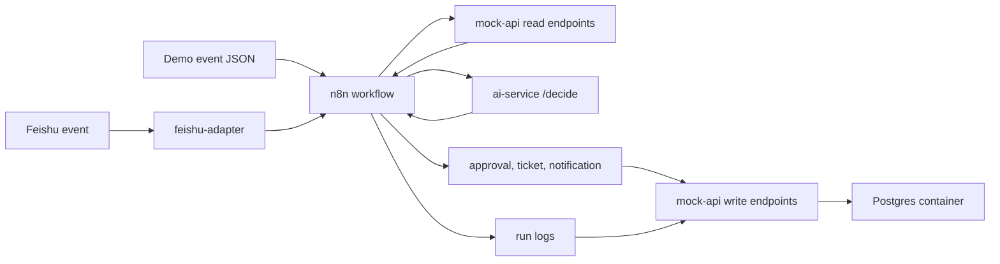

# Ecommerce After-sales Multi-agent Workflow

Docker-first portfolio project for an enterprise-style ecommerce after-sales workflow. It uses n8n for orchestration, FastAPI services for AI decisioning and mock enterprise APIs, and scripted events for repeatable demos.

## What This Demonstrates

- n8n workflow orchestration for enterprise-style automation.
- FastAPI AI service with structured outputs and deterministic test mode.
- Mock enterprise APIs for orders, inventory, logistics, support, approvals, run logs, and replay.
- Docker Compose local deployment.
- AI Ops patterns: schema validation, approval guardrails, run logging, dead-letter, replay.

## Architecture



The current implementation keeps business state in memory for a lightweight local demo while running Postgres in Compose as the operational store target for the next phase.

## Quick Start

```powershell
docker compose up --build -d
```

Open n8n at `http://localhost:5678`.

Health checks:

```powershell
Invoke-RestMethod http://localhost:8001/health
Invoke-RestMethod http://localhost:8002/health
Invoke-RestMethod http://localhost:8002/orders/ord_100
```

## Import n8n Workflow

The workflow file is `n8n/workflows/ecommerce-after-sales.json`. It exposes:

```text
POST /webhook/after-sales-event
```

CLI import:

```powershell
docker compose exec -T n8n n8n import:workflow --input=/workflows/ecommerce-after-sales.json
docker compose exec -T n8n n8n publish:workflow --id=wf_ecommerce_after_sales
docker compose exec -T n8n n8n update:workflow --id=wf_ecommerce_after_sales --active=true
docker compose restart n8n
```

## Demo

Send a high-value refund event:

```powershell
powershell -ExecutionPolicy Bypass -File .\scripts\send_event.ps1 -EventFile fixtures/events/refund_high_value.json
```

Expected result: the workflow returns a structured AI decision, creates a pending approval request, and writes a succeeded run log.

Replay a failed event:

```powershell
powershell -ExecutionPolicy Bypass -File .\scripts\replay_failed_event.ps1 -EventId evt_mock_api_failure
```

Expected result: `queued_for_replay`.

## Message Agent Demo

The second workflow is `n8n/workflows/message-agent.json`. It exposes:

```text
POST /webhook/message-agent
```

It accepts text or audio-shaped message payloads, calls `ai-service /message/handle`, and lets the agent invoke the first tool: `get_order_status`.

Import it with:

```powershell
docker compose exec -T n8n n8n import:workflow --input=/workflows/message-agent.json
docker compose exec -T n8n n8n publish:workflow --id=wf_message_agent
docker compose restart n8n
```

Send a text message:

```powershell
powershell -ExecutionPolicy Bypass -File .\scripts\send_message.ps1 -MessageFile fixtures\messages\order_status_text.json
```

Audio support is adapter-based. The current default is `TRANSCRIPTION_PROVIDER=mock`. To connect Qwen, provide `QWEN_API_ENDPOINT`, `QWEN_API_KEY`, the confirmed model name, the expected audio input format, and an example response JSON.

## Feishu Adapter

`feishu-adapter` is a dedicated container for Feishu/Lark protocol handling. It receives Feishu event callbacks, handles URL verification, normalizes chat messages, forwards them to the n8n chat gateway, and replies to Feishu when `FEISHU_APP_ID` and `FEISHU_APP_SECRET` are configured.

Local endpoint:

```text
POST http://localhost:8010/feishu/events
```

Default internal n8n target:

```text
http://n8n:5678/webhook/chat-agent-inbound
```

For real Feishu event subscriptions, expose `http://localhost:8010/feishu/events` through a public HTTPS tunnel or server URL, then use that public URL in Feishu Developer Console.

## Chat Parent/Son Agent Workflow

The versioned n8n chat workflow is `n8n/workflows/chat-parent-son-agent.json`. It uses a parent agent to dispatch tasks:

- `weather_agent` handles weather questions.
- `after_sales_agent` handles ecommerce after-sales, order, logistics, refund, return, and complaint questions.
- `echo_task_tool` handles explicit test or echo requests.

The after-sales son agent calls `order_status_tool`, which reads from `mock-api /orders/{order_id}` and `/shipments/{shipment_id}`. Feishu users can ask messages such as `帮我查一下订单 ord_100`, and the result is returned through `feishu-adapter`.

All chat messages enter the parent agent first. For `ord_*` order questions, the parent agent calls `after_sales_agent`, and that son agent calls `order_status_tool` to query the backend API before returning a Feishu-ready answer.

Import and publish:

```powershell
docker compose exec -T n8n n8n import:workflow --input=/workflows/chat-parent-son-agent.json
docker compose exec -T n8n n8n publish:workflow --id=wechat-qwen-agent-template
docker compose restart n8n
```

## Useful Endpoints

- `GET http://localhost:8001/health`
- `POST http://localhost:8001/decide`
- `POST http://localhost:8001/message/handle`
- `GET http://localhost:8010/health`
- `POST http://localhost:8010/feishu/events`
- `GET http://localhost:8002/orders/{order_id}`
- `GET http://localhost:8002/customers/{customer_id}`
- `GET http://localhost:8002/shipments/{shipment_id}`
- `GET http://localhost:8002/inventory/{sku}`
- `GET http://localhost:8002/approval-requests`
- `GET http://localhost:8002/tickets`
- `GET http://localhost:8002/internal-notifications`
- `GET http://localhost:8002/run-logs`
- `GET http://localhost:8002/dead-letter`

## Test

Run service tests separately to avoid duplicate `test_api.py` import names across service packages:

```powershell
pytest services\ai-service\tests
pytest services\mock-api\tests
pytest services\feishu-adapter\tests
pytest tests\test_chat_parent_son_workflow.py
```

## Project Documents

- [Architecture](docs/architecture.md)
- [Demo Script](docs/demo-script.md)
- [Local Runbook](docs/local-runbook.md)
- [n8n Workflow Contract](docs/n8n-workflow-contract.md)
- [中文 README](README.zh.md)
