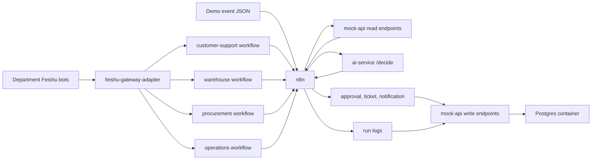

# 内部电商运营 Copilot

这是一个 Docker-first 的作品集项目，用企业内部电商运营流程来展示 AI workflow 落地能力。项目使用一个 Feishu Gateway Adapter 连接多个部门机器人，使用多个部门独立 n8n workflow，FastAPI 负责 AI 逻辑和 mock 企业 API，并通过脚本化事件支持可重复 demo。

## 这个项目展示什么

- 使用 n8n 编排企业风格的自动化 workflow。
- 使用一个 Feishu gateway adapter，把多个部门机器人连接到各自的 n8n workflow。
- 使用 FastAPI 构建带结构化输出和 deterministic test mode 的 AI service。
- 使用 mock enterprise APIs 模拟订单、库存、物流、客服、审批、运行日志和 replay。
- 使用 Docker Compose 做本地部署。
- 体现 AI Ops 模式：schema validation、approval guardrails、run logging、dead-letter、replay。

## 架构



当前实现为了让本地 demo 更轻量，业务记录暂存在内存中；Compose 中已经运行 Postgres，作为下一阶段运维存储落地目标。

## 快速启动

```powershell
docker compose up --build -d
```

打开 n8n：`http://localhost:5678`。

健康检查：

```powershell
Invoke-RestMethod http://localhost:8001/health
Invoke-RestMethod http://localhost:8002/health
Invoke-RestMethod http://localhost:8010/health/details | ConvertTo-Json -Depth 10
Invoke-RestMethod http://localhost:8002/orders/ord_100
```

## 导入 n8n Workflow

workflow 文件是 `n8n/workflows/ecommerce-after-sales.json`。它暴露：

```text
POST /webhook/after-sales-event
```

使用 CLI 导入：

```powershell
docker compose exec -T n8n n8n import:workflow --input=/workflows/ecommerce-after-sales.json
docker compose exec -T n8n n8n publish:workflow --id=wf_ecommerce_after_sales
docker compose exec -T n8n n8n update:workflow --id=wf_ecommerce_after_sales --active=true
docker compose restart n8n
```

## Demo

发送高价值退款事件：

```powershell
powershell -ExecutionPolicy Bypass -File .\scripts\send_event.ps1 -EventFile fixtures/events/refund_high_value.json
```

预期结果：workflow 返回结构化 AI decision，创建 pending approval request，并写入 succeeded run log。

Replay 一个失败事件：

```powershell
powershell -ExecutionPolicy Bypass -File .\scripts\replay_failed_event.ps1 -EventId evt_mock_api_failure
```

预期结果：`queued_for_replay`。

## Message Agent Demo

第二个 workflow 是 `n8n/workflows/message-agent.json`。它暴露：

```text
POST /webhook/message-agent
```

它接收文本或音频形态的 message payload，调用 `ai-service /message/handle`，并让 agent 调用第一个工具：`get_order_status`。

导入命令：

```powershell
docker compose exec -T n8n n8n import:workflow --input=/workflows/message-agent.json
docker compose exec -T n8n n8n publish:workflow --id=wf_message_agent
docker compose restart n8n
```

发送文本消息：

```powershell
powershell -ExecutionPolicy Bypass -File .\scripts\send_message.ps1 -MessageFile fixtures\messages\order_status_text.json
```

音频支持通过 adapter 接入。当前默认是 `TRANSCRIPTION_PROVIDER=mock`。如果要接入 Qwen，需要你提供 `QWEN_API_ENDPOINT`、`QWEN_API_KEY`、确认后的模型名、API 期望的音频输入格式，以及返回 JSON 示例。

## 飞书 Gateway Adapter

`feishu-adapter` 是专门处理飞书/Lark 协议的容器。现在它可以通过 `FEISHU_BOTS_JSON` 作为多部门机器人网关运行。每个 bot 会建立自己的飞书长连接，把消息转发到自己的 n8n webhook，按 `bot_name + message_id` 去重，并使用该 bot 自己的凭证回复飞书。

如果 `FEISHU_BOTS_JSON` 留空，仍会使用旧的单机器人 fallback：`FEISHU_APP_ID`、`FEISHU_APP_SECRET` 和 `N8N_CHAT_WEBHOOK_URL`。

本地模拟端点：

```text
POST http://localhost:8010/feishu/events
```

部门机器人配置示例：

```text
FEISHU_BOTS_JSON=[{"name":"customer_support","app_id":"cli_customer","app_secret":"secret_customer","n8n_webhook_url":"http://n8n:5678/webhook/customer-support-inbound"}]
```

真实接入飞书长连接事件订阅时，保持 `FEISHU_EVENT_MODE=long_connection`，在飞书开发者后台启用 `im.message.receive_v1` 事件订阅，把机器人安装到目标会话，然后启动 Docker。adapter 日志出现 `connected to wss://msg-frontier.feishu.cn/...` 表示长连接已建立。

## 部门 Chat Workflows

当前推荐的内部聊天架构是多个部门独立 workflow，不再用 parent/son 分发图作为主链路：

- `n8n/workflows/customer-support-workflow.json` 暴露 `/webhook/customer-support-inbound`。
- `n8n/workflows/warehouse-workflow.json` 暴露 `/webhook/warehouse-inbound`。
- `n8n/workflows/procurement-workflow.json` 暴露 `/webhook/procurement-inbound`。
- `n8n/workflows/operations-workflow.json` 暴露 `/webhook/operations-inbound`。

`n8n/workflows/chat-parent-son-agent.json` 仍保留在仓库中作为兼容历史文件，但不再推荐作为主要聊天链路。

导入并发布：

```powershell
docker compose exec -T n8n n8n import:workflow --input=/workflows/customer-support-workflow.json
docker compose exec -T n8n n8n import:workflow --input=/workflows/warehouse-workflow.json
docker compose exec -T n8n n8n import:workflow --input=/workflows/procurement-workflow.json
docker compose exec -T n8n n8n import:workflow --input=/workflows/operations-workflow.json
docker compose exec -T n8n n8n publish:workflow --id=customer-support-workflow
docker compose exec -T n8n n8n publish:workflow --id=warehouse-workflow
docker compose exec -T n8n n8n publish:workflow --id=procurement-workflow
docker compose exec -T n8n n8n publish:workflow --id=operations-workflow
docker compose restart n8n
```

## 常用端点

- `GET http://localhost:8001/health`
- `POST http://localhost:8001/decide`
- `POST http://localhost:8001/message/handle`
- `GET http://localhost:8010/health`
- `GET http://localhost:8010/health/details`
- `POST http://localhost:8010/feishu/events`
- `POST http://localhost:8010/warehouse/inventory-table/sync`
- `GET http://localhost:8002/orders/{order_id}`
- `GET http://localhost:8002/customers/{customer_id}`
- `GET http://localhost:8002/shipments/{shipment_id}`
- `GET http://localhost:8002/inventory/{sku}`
- `GET http://localhost:8002/approval-requests`
- `GET http://localhost:8002/tickets`
- `GET http://localhost:8002/internal-notifications`
- `GET http://localhost:8002/run-logs`
- `GET http://localhost:8002/dead-letter`

## 测试

两个服务目录中都有 `test_api.py`，因此测试建议分开运行，避免 pytest 模块名冲突：

```powershell
pytest services\ai-service\tests
pytest services\mock-api\tests
pytest services\feishu-adapter\tests
pytest tests\test_chat_parent_son_workflow.py
pytest tests\test_department_workflows.py
```

## 项目文档

- [架构说明](docs/architecture.zh.md)
- [Demo 脚本](docs/demo-script.zh.md)
- [部署和运维](docs/deployment.zh.md)
- [仓储库存飞书表格同步](docs/warehouse-inventory-table-sync.zh.md)
- [仓储视图模板构建器](docs/warehouse-view-template-builder.zh.md)
- [本地运行手册](docs/local-runbook.zh.md)
- [n8n Workflow Contract](docs/n8n-workflow-contract.zh.md)
- [English README](README.md)
