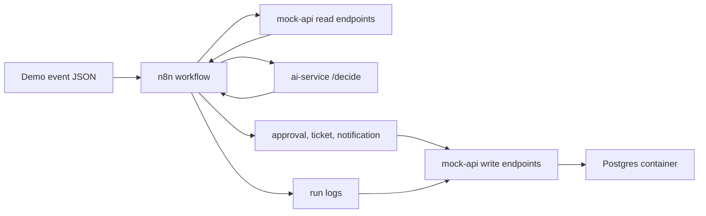

# 电商售后 Multi-agent Workflow

这是一个 Docker-first 的作品集项目，用企业内部电商售后流程来展示 AI workflow 落地能力。项目使用 n8n 做编排，FastAPI 做 AI 决策服务和 mock 企业 API，并通过脚本化事件支持可重复 demo。

## 这个项目展示什么

- 使用 n8n 编排企业风格的自动化 workflow。
- 使用 FastAPI 构建带结构化输出和 deterministic test mode 的 AI service。
- 使用 mock enterprise APIs 模拟订单、库存、物流、客服、审批、运行日志和 replay。
- 使用 Docker Compose 做本地部署。
- 体现 AI Ops 模式：schema validation、approval guardrails、run logging、dead-letter、replay。

## 架构



当前实现为了让本地 demo 更轻量，业务记录暂存在内存中；Compose 中已经运行 Postgres，作为下一阶段运维存储落地目标。

## 快速启动

```powershell
docker compose up --build -d
```

打开 n8n：`http://localhost:5678`。

健康检查：

```powershell
Invoke-RestMethod http://localhost:8001/health
Invoke-RestMethod http://localhost:8002/health
Invoke-RestMethod http://localhost:8002/orders/ord_100
```

## 导入 n8n Workflow

workflow 文件是 `n8n/workflows/ecommerce-after-sales.json`。它暴露：

```text
POST /webhook/after-sales-event
```

使用 CLI 导入：

```powershell
docker compose exec -T n8n n8n import:workflow --input=/workflows/ecommerce-after-sales.json
docker compose exec -T n8n n8n publish:workflow --id=wf_ecommerce_after_sales
docker compose exec -T n8n n8n update:workflow --id=wf_ecommerce_after_sales --active=true
docker compose restart n8n
```

## Demo

发送高价值退款事件：

```powershell
powershell -ExecutionPolicy Bypass -File .\scripts\send_event.ps1 -EventFile fixtures/events/refund_high_value.json
```

预期结果：workflow 返回结构化 AI decision，创建 pending approval request，并写入 succeeded run log。

Replay 一个失败事件：

```powershell
powershell -ExecutionPolicy Bypass -File .\scripts\replay_failed_event.ps1 -EventId evt_mock_api_failure
```

预期结果：`queued_for_replay`。

## 常用端点

- `GET http://localhost:8001/health`
- `POST http://localhost:8001/decide`
- `GET http://localhost:8002/orders/{order_id}`
- `GET http://localhost:8002/customers/{customer_id}`
- `GET http://localhost:8002/shipments/{shipment_id}`
- `GET http://localhost:8002/inventory/{sku}`
- `GET http://localhost:8002/approval-requests`
- `GET http://localhost:8002/tickets`
- `GET http://localhost:8002/internal-notifications`
- `GET http://localhost:8002/run-logs`
- `GET http://localhost:8002/dead-letter`

## 测试

两个服务目录中都有 `test_api.py`，因此测试建议分开运行，避免 pytest 模块名冲突：

```powershell
pytest services\ai-service\tests
pytest services\mock-api\tests
```

## 项目文档

- [架构说明](docs/architecture.zh.md)
- [Demo 脚本](docs/demo-script.zh.md)
- [本地运行手册](docs/local-runbook.zh.md)
- [n8n Workflow Contract](docs/n8n-workflow-contract.zh.md)
- [English README](README.md)
