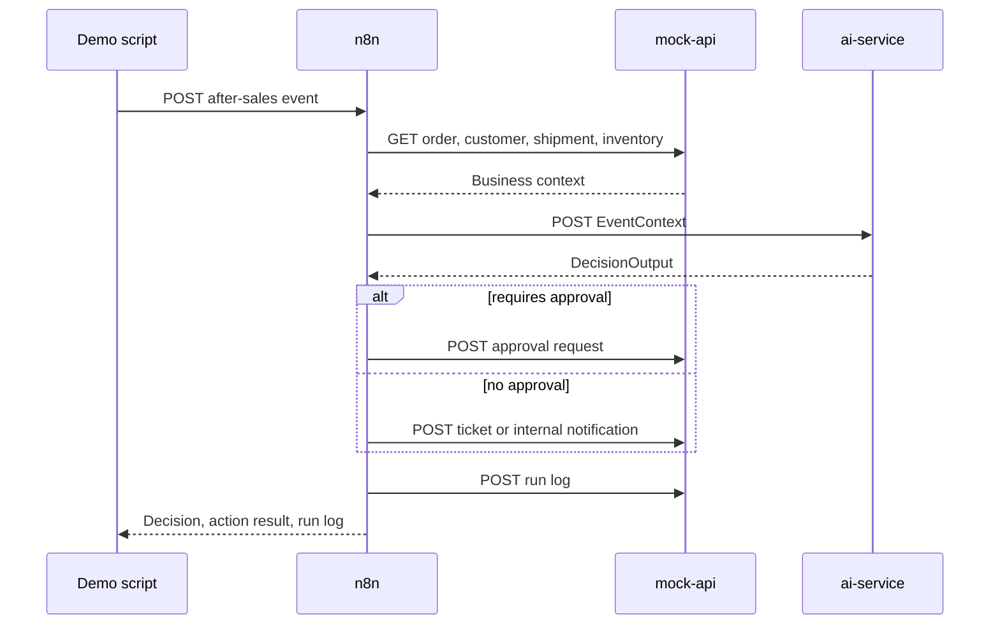

# Architecture

## System Goal

This project models an internal ecommerce operations copilot. Department employees interact through Feishu bots, and each bot maps to an independent n8n workflow for customer support, warehouse, procurement, or operations work. The system can also run scripted after-sales events for repeatable demos.

It is intentionally built as a local, Docker-first demo so the system can be shown without external SaaS accounts or paid model calls.

## Components

### Feishu Gateway Adapter

`feishu-adapter` owns Feishu/Lark protocol handling. It supports multi-bot long connection mode, normalizes inbound messages, filters shared-group messages by bot mention, forwards each department bot to its own n8n webhook, replies with the matching bot credentials, and writes structured run logs when configured.

The detailed health endpoint `GET /health/details` reports bot names, webhook configuration, listener count, processed message count, and run-log status without exposing secrets.

### n8n Orchestration Layer

n8n owns workflow sequencing for both event workflows and department chat workflows:

1. Receive an after-sales event through `POST /webhook/after-sales-event`.
2. Fetch order, customer, shipment, and inventory context from `mock-api`.
3. Build an `EventContext` payload.
4. Call `ai-service /decide`.
5. Create an approval request, support ticket, or internal notification.
6. Write a run log.

The main internal chat path uses independent department workflows rather than a legacy Parent/Son dispatcher graph. This keeps department ownership and tool permissions easier to explain and test.

The workflow uses n8n HTTP Request nodes for service calls. Code nodes only reshape JSON payloads, which keeps the flow compatible with n8n v2 where Code nodes cannot make direct HTTP requests.

### ai-service

`services/ai-service` is the model-facing logic boundary. It exposes:

- `GET /health`
- `POST /decide`

The service validates input and output through Pydantic schemas. The first implementation uses deterministic fake AI logic so tests and demos are repeatable. In production, this service is the right place to add model provider calls, prompt templates, retrieval, tracing, token accounting, and fallback behavior.

### mock-api

`services/mock-api` simulates replaceable enterprise systems:

- Orders
- Customers
- Shipments
- Inventory
- Approval requests
- Support tickets
- Internal notifications
- Run logs
- Dead-letter records
- Replay requests

Fixture data lives in `fixtures/data`, and scripted events live in `fixtures/events`. When `DATABASE_URL` is configured, `mock-api` creates the batch + location warehouse model in Postgres: `warehouses`, `storage_locations`, `categories`, `items`, and `inventory_batches`. Warehouse endpoints read Postgres first and fall back to fixtures when no database is configured.

### Postgres

Postgres runs in Docker Compose as the operational store target. `ai-service` can use it for `session_state` and `user_profile`, and `mock-api` uses it for warehouse batch + location inventory when `DATABASE_URL` is configured. Some action records are still in-memory inside `mock-api`; the target production shape is persistent approvals, run logs, dead letters, replay history, compact user profiles, and short-term session state.

## Decision Flow

## AI Ops Patterns

- Schema validation at the AI boundary through `EventContext` and `DecisionOutput`.
- Deterministic fake AI mode for repeatable tests and demos.
- Approval guardrails for high-value refunds, VIP cases, and public review risk.
- Run logs with message/event id, bot name, workflow, status, latency, tool calls, and error.
- Dead-letter endpoint for unrecoverable events.
- Replay endpoint for failed-event recovery workflows.
- Multi-bot Feishu safeguards for duplicate messages and shared-group fan-out.
- Policy RAG metadata with source file, section, and clause id.
- Warehouse facts stay behind `mock-api` or a future warehouse-service API. n8n and `feishu-adapter` should not read warehouse Postgres tables directly.
- One-way warehouse inventory snapshots to Feishu tables as a read model, with inventory writes kept in the source system.

## SaaS Replacement Points

The mock components are intentionally easy to replace:

- Shopify or custom commerce backend replaces order and inventory reads.
- Zendesk, Intercom, or Freshdesk replaces support tickets.
- Slack, Teams, or email replaces internal notifications.
- ERP or warehouse system replaces procurement alerts.
- Logistics provider APIs replace shipment status.
- Approval platform, Jira, Linear, or internal admin system replaces approval requests.
- OpenAI, Azure OpenAI, Anthropic, or a local model gateway replaces deterministic AI mode inside `ai-service`.

## Operational Boundaries

The main boundary is between n8n and `ai-service`. n8n should coordinate systems and retries; `ai-service` should own model prompting, model selection, schema validation, and policy-aware decisioning. This keeps workflow logic readable and makes the AI layer deployable as normal backend software.
