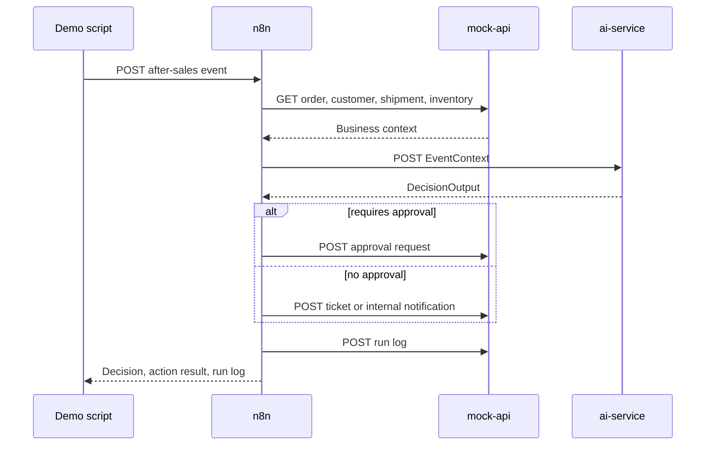

# 架构说明

## 系统目标

这个项目模拟一个企业内部电商售后 workflow。流程接收运营事件，从企业系统获取上下文，让 AI decision service 返回结构化建议，再根据风控规则执行动作，并记录运行结果。

项目刻意设计成本地 Docker-first demo，这样不依赖外部 SaaS 账号或付费模型调用，也可以完整展示。

## 组件

### n8n 编排层

n8n 负责 workflow 顺序：

1. 通过 `POST /webhook/after-sales-event` 接收售后事件。
2. 从 `mock-api` 获取订单、客户、物流和库存上下文。
3. 构建 `EventContext` payload。
4. 调用 `ai-service /decide`。
5. 创建审批请求、客服工单或内部通知。
6. 写入 run log。

workflow 使用 n8n HTTP Request 节点做服务调用。Code 节点只负责 JSON 整形，这样可以兼容 n8n v2，因为 n8n v2 的 Code 节点不能直接发 HTTP 请求。

### ai-service

`services/ai-service` 是面向模型逻辑的边界。它暴露：

- `GET /health`
- `POST /decide`

服务通过 Pydantic schema 校验输入和输出。第一版使用 deterministic fake AI logic，让测试和 demo 可重复。生产环境中，模型提供商调用、prompt templates、retrieval、tracing、token accounting 和 fallback behavior 都应该放在这一层。

### mock-api

`services/mock-api` 模拟可替换的企业系统：

- 订单
- 客户
- 物流
- 库存
- 审批请求
- 客服工单
- 内部通知
- 运行日志
- Dead-letter records
- Replay requests

fixture 数据位于 `fixtures/data`，脚本化事件位于 `fixtures/events`。

### Postgres

Postgres 通过 Docker Compose 启动，作为运维存储目标。当前轻量 demo 中，动作记录暂存在 `mock-api` 内存里；下一阶段可以把 approvals、run logs、dead letters 和 replay history 持久化到 Postgres。

## 决策流程

## AI Ops 模式

- 在 AI 边界通过 `EventContext` 和 `DecisionOutput` 做 schema validation。
- 使用 deterministic fake AI mode，让测试和 demo 可重复。
- 对高价值退款、VIP case 和公开差评风险设置 approval guardrails。
- run log 记录 event id、workflow id、status、latency、model、token estimate 和 error。
- dead-letter endpoint 用于不可恢复事件。
- replay endpoint 用于失败事件恢复流程。

## SaaS 替换点

mock 组件被设计成容易替换：

- Shopify 或自研电商后端替换订单和库存读取。
- Zendesk、Intercom 或 Freshdesk 替换客服工单。
- Slack、Teams 或邮件替换内部通知。
- ERP 或仓储系统替换采购提醒。
- 物流服务商 API 替换 shipment status。
- 审批平台、Jira、Linear 或内部 admin system 替换 approval requests。
- OpenAI、Azure OpenAI、Anthropic 或本地模型网关替换 `ai-service` 中的 deterministic AI mode。

## 运维边界

最关键的边界是 n8n 和 `ai-service` 之间。n8n 应该负责系统编排和重试；`ai-service` 应该负责模型 prompt、模型选择、schema validation 和带政策约束的决策。这样 workflow 更容易读，AI 层也可以像普通后端服务一样部署和维护。
