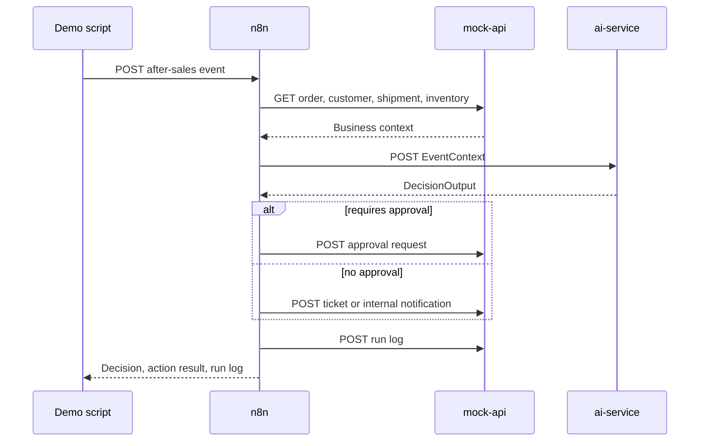

# 架构说明

## 系统目标

这个项目模拟一个企业内部电商运营 Copilot。内部员工通过不同部门的飞书机器人交互，每个机器人对应一个独立 n8n workflow，分别处理客服、仓储、采购和运营工作。系统也保留脚本化售后事件，用于可重复 demo。

项目刻意设计成本地 Docker-first demo，这样不依赖外部 SaaS 账号或付费模型调用，也可以完整展示。

## 组件

### Feishu Gateway Adapter

`feishu-adapter` 负责飞书/Lark 协议处理。它支持多 bot 长连接模式，会归一化收到的消息，在共享群聊中按 @ 目标 bot 过滤消息，把每个部门 bot 转发到自己的 n8n webhook，用对应 bot 凭证回复飞书，并在配置后写入结构化 run log。

详细健康检查 `GET /health/details` 会展示 bot 名称、webhook 配置、listener 数量、已处理消息数量和 run-log 状态，但不会暴露 secret。

### n8n 编排层

n8n 负责事件 workflow 和部门聊天 workflow 的编排：

1. 通过 `POST /webhook/after-sales-event` 接收售后事件。
2. 从 `mock-api` 获取订单、客户、物流和库存上下文。
3. 构建 `EventContext` payload。
4. 调用 `ai-service /decide`。
5. 创建审批请求、客服工单或内部通知。
6. 写入 run log。

当前主内部聊天链路使用多个部门独立 workflow，而不是 legacy Parent/Son 分发图。这样部门归属和工具权限更容易解释和测试。

workflow 使用 n8n HTTP Request 节点做服务调用。Code 节点只负责 JSON 整形，这样可以兼容 n8n v2，因为 n8n v2 的 Code 节点不能直接发 HTTP 请求。

### ai-service

`services/ai-service` 是面向模型逻辑的边界。它暴露：

- `GET /health`
- `POST /decide`

服务通过 Pydantic schema 校验输入和输出。第一版使用 deterministic fake AI logic，让测试和 demo 可重复。生产环境中，模型提供商调用、prompt templates、retrieval、tracing、token accounting 和 fallback behavior 都应该放在这一层。

### mock-api

`services/mock-api` 模拟可替换的企业系统：

- 订单
- 客户
- 物流
- 库存
- 审批请求
- 客服工单
- 内部通知
- 运行日志
- Dead-letter records
- Replay requests

fixture 数据位于 `fixtures/data`，脚本化事件位于 `fixtures/events`。配置 `DATABASE_URL` 后，`mock-api` 会在 Postgres 中创建 `warehouse_inventory`、`warehouse_locations` 和 `warehouse_exceptions`，并从 fixtures seed 初始数据。仓储 endpoint 优先读 Postgres；没有配置数据库时才 fallback 到 fixtures。

### Postgres

Postgres 通过 Docker Compose 启动，作为运维存储目标。`ai-service` 可以使用它保存 `session_state` 和 `user_profile`；配置 `DATABASE_URL` 后，`mock-api` 使用它保存仓储库存、库位和仓储异常。部分动作记录仍暂存在 `mock-api` 内存里；目标生产形态是持久化 approvals、run logs、dead letters、replay history、精简 user profile 和短期 session state。

## 决策流程

## AI Ops 模式

- 在 AI 边界通过 `EventContext` 和 `DecisionOutput` 做 schema validation。
- 使用 deterministic fake AI mode，让测试和 demo 可重复。
- 对高价值退款、VIP case 和公开差评风险设置 approval guardrails。
- run log 记录 message/event id、bot name、workflow、status、latency、tool calls 和 error。
- dead-letter endpoint 用于不可恢复事件。
- replay endpoint 用于失败事件恢复流程。
- 多 bot 飞书场景下处理重复消息和共享群聊 fan-out。
- 政策 RAG 保留 source file、section 和 clause id 元数据。
- 仓储事实数据保留在 `mock-api` 或未来 warehouse-service API 后面；n8n 和 `feishu-adapter` 不直接读取仓储 PostgreSQL 表。
- 仓储库存可以单向同步为飞书表格快照/read model，库存写入仍保留在源系统。

## SaaS 替换点

mock 组件被设计成容易替换：

- Shopify 或自研电商后端替换订单和库存读取。
- Zendesk、Intercom 或 Freshdesk 替换客服工单。
- Slack、Teams 或邮件替换内部通知。
- ERP 或仓储系统替换采购提醒。
- 物流服务商 API 替换 shipment status。
- 审批平台、Jira、Linear 或内部 admin system 替换 approval requests。
- OpenAI、Azure OpenAI、Anthropic 或本地模型网关替换 `ai-service` 中的 deterministic AI mode。

## 运维边界

最关键的边界是 n8n 和 `ai-service` 之间。n8n 应该负责系统编排和重试；`ai-service` 应该负责模型 prompt、模型选择、schema validation 和带政策约束的决策。这样 workflow 更容易读，AI 层也可以像普通后端服务一样部署和维护。
